# AIFlix - Project Checkpoint Documentation

## Project Overview
AI video platform (Netflix-style) where users can create AI-generated videos, browse community content, and manage their video library.

## Tech Stack
- **Framework**: Next.js 16.0.2 (App Router)
- **Language**: TypeScript
- **Styling**: Tailwind CSS v4
- **Build Tool**: Turbopack
- **Dev Server**: Running on port 3001

## Design System
- **Color Palette**: Black, White, and Gray only (brand not yet defined)
- **Navigation**: Icon-only left sidebar (Netflix-style, 80px wide)
- **Typography**: Geist Sans and Geist Mono
- **Layout**: Fixed sidebar with margin-left offset for app pages

---

## File Structure

```
/Users/dev/Desktop/muxVideo/
├── app/
│   ├── layout.tsx                 # Root layout with sidebar
│   ├── page.tsx                   # Marketing landing page
│   ├── browse/
│   │   └── page.tsx              # Browse all videos (Netflix-style)
│   ├── create/
│   │   └── page.tsx              # Create AI video with prompt
│   ├── my-videos/
│   │   └── page.tsx              # User's video library + stats
│   ├── video/
│   │   └── [id]/
│   │       └── page.tsx          # Individual video view
│   ├── credits/
│   │   └── page.tsx              # Purchase credit packages
│   └── auth/
│       ├── login/
│       │   └── page.tsx          # Login page
│       └── signup/
│           └── page.tsx          # Signup page (50 free credits)
├── components/
│   ├── sidebar.tsx               # Icon-only navigation (80px wide)
│   └── layout-wrapper.tsx        # Adds ml-20 for app pages
├── lib/
│   └── mock-data.ts              # Mock user and videos data
├── types/
│   └── index.ts                  # TypeScript interfaces
└── next.config.ts                # Next.js config (Unsplash images)
```

---

## Routes & Pages

### Public Routes

#### `/` - Landing Page (Marketing)
- **Purpose**: Attract new users
- **Features**:
  - Hero section with CTA
  - Features showcase
  - How it works (3 steps)
  - Testimonials
  - Pricing preview
  - Final CTA section
- **Navigation**: Top navbar with logo + auth links
- **Actions**: Sign up, Get Started

#### `/auth/login` - Login
- **Purpose**: User authentication
- **Features**:
  - Email/password form
  - Remember me checkbox
  - Forgot password link
  - Social auth buttons (Google, GitHub)
  - Link to signup
- **Redirects**: `/browse` after login
- **Navigation**: Simple header with logo only

#### `/auth/signup` - Sign Up
- **Purpose**: New user registration
- **Features**:
  - Name, email, password fields
  - Terms & Privacy checkboxes
  - 50 FREE credits banner
  - Social auth buttons (Google, GitHub)
  - Link to login
- **Redirects**: `/browse` after signup
- **Navigation**: Simple header with logo only

### Authenticated Routes

#### `/browse` - Browse Videos
- **Purpose**: Discover AI videos from all users
- **Features**:
  - Featured video hero section
  - Trending videos section
  - Recent uploads section
  - All videos grid
  - Video thumbnails with duration badges
  - Hover effects with scale animation
- **Layout**: Left sidebar navigation
- **Data**: Shows all mockVideos

#### `/create` - Create AI Video
- **Purpose**: Generate new AI video from text prompt
- **Features**:
  - Current credit balance display
  - Text area for video description/prompt
  - Duration selector (30s/60s/90s)
  - Credit cost calculator (5/10/20 credits)
  - Example prompts for inspiration
  - Tips for better results
  - Remaining credits preview
  - Buy more credits button
- **Layout**: Left sidebar navigation
- **Validation**: Checks if user has enough credits

#### `/my-videos` - My Videos
- **Purpose**: Manage user's created videos
- **Features**:
  - Stats dashboard (Total Videos, Views, Likes, Credits)
  - Processing videos section with progress bars
  - Published videos grid
  - Video management actions (View, Edit, Delete)
  - Empty state with CTA
  - Create new video button
- **Layout**: Left sidebar navigation
- **Data**: Filters mockVideos by mockUser.id

#### `/video/[id]` - Video Details
- **Purpose**: Watch and interact with individual video
- **Features**:
  - Video player (placeholder with thumbnail + play button)
  - Video metadata (title, description, views, date)
  - Creator information with avatar
  - Like and Share buttons
  - AI prompt used section
  - Related videos sidebar (4 videos)
  - Comments section (placeholder)
  - "Create Your Own" CTA
- **Layout**: Left sidebar navigation
- **Dynamic Route**: Uses [id] parameter
- **404**: Returns notFound() if video doesn't exist

#### `/credits` - Buy Credits
- **Purpose**: Purchase credit packages
- **Features**:
  - Current balance display
  - 4 pricing tiers (Starter, Pro, Ultimate, Enterprise)
  - "Most Popular" badge on Pro package
  - Savings badges on higher tiers
  - Price per credit calculation
  - Video count estimates
  - Purchase simulation (2s delay + alert)
  - How Credits Work section
  - FAQ section
- **Layout**: Left sidebar navigation
- **Packages**:
  - Starter: 100 credits @ $9.99
  - Pro: 500 credits @ $39.99 (20% savings)
  - Ultimate: 1000 credits @ $69.99 (30% savings)
  - Enterprise: 5000 credits @ $299.99 (40% savings)

---

## Components

### `<Sidebar />` - Icon Navigation
**File**: `/components/sidebar.tsx`

**Design**:
- Fixed left position, 80px wide
- Black background
- Icons ONLY (no text labels)
- Tooltip on hover (title attribute)

**Structure**:
- Logo at top (white "A" in white box)
- Navigation icons (centered vertically):
  - Search (magnifying glass)
  - Home (house icon)
  - Create (+/plus icon)
  - My Videos (play icon)
  - Credits (lightning bolt)
- User avatar at bottom (gray circle with initial)

**Active State**: White text (inactive = gray-500)

**Reference**: Netflix-style icon navigation

### `<LayoutWrapper />` - Layout Manager
**File**: `/components/layout-wrapper.tsx`

**Purpose**: Conditionally adds left margin for sidebar

**Logic**:
- Marketing page (`/`): No margin
- Auth pages (`/auth/*`): No margin
- App pages: `ml-20` (80px left margin)

---

## Data Models

### TypeScript Interfaces
**File**: `/types/index.ts`

```typescript
interface User {
  id: string;
  email: string;
  name: string;
  credits: number;
  createdAt: Date;
}

interface Video {
  id: string;
  title: string;
  description: string;
  prompt: string;
  thumbnailUrl: string;
  videoUrl: string;
  duration: number;  // in seconds
  views: number;
  likes: number;
  creatorId: string;
  creatorName: string;
  createdAt: Date;
  status: 'processing' | 'completed' | 'failed';
}

interface VideoGeneration {
  id: string;
  prompt: string;
  status: 'processing' | 'completed' | 'failed';
  createdAt: Date;
  estimatedTime?: number;  // in seconds
  videoId?: string;
}
```

### Mock Data
**File**: `/lib/mock-data.ts`

**mockUser**:
- ID: "1"
- Name: "Demo User"
- Email: "user@example.com"
- Credits: 50
- Created: 2024-01-01

**mockVideos**: 6 sample videos
- IDs: "1" through "6"
- Creators: Various mock users
- Thumbnails: Unsplash images
- Durations: 30-60 seconds
- Views: 1.2M to 892K
- Likes: 12K to 89K
- Status: All "completed"

---

## User Flows

### 1. New User Onboarding
```
Landing Page (/)
  ↓ [Sign Up]
Signup Page (/auth/signup)
  ↓ [Create Account]
  → Receives 50 FREE credits
  ↓ [Auto redirect]
Browse Page (/browse)
```

### 2. Returning User Login
```
Landing Page (/)
  ↓ [Log In]
Login Page (/auth/login)
  ↓ [Submit credentials]
  ↓ [Auto redirect]
Browse Page (/browse)
```

### 3. Create Video Flow
```
Browse (/browse) OR My Videos (/my-videos)
  ↓ [Click sidebar Create icon OR "Create New Video" button]
Create Page (/create)
  ↓ [Enter prompt + select duration]
  ↓ [Check credits available]
  ↓ [Generate Video]
  → Deducts credits (5/10/20)
  → Shows alert: "Check My Videos to see progress"
  ↓ [Navigate to My Videos]
My Videos (/my-videos)
  → See video in "Processing Videos" section
  → Eventually appears in "Published Videos"
```

### 4. Browse & Watch Flow
```
Browse Page (/browse)
  ↓ [Click video thumbnail or title]
Video Page (/video/[id])
  ↓ [Watch video, like, share]
  ↓ [Click related video]
Another Video Page (/video/[different-id])
  OR
  ↓ [Click "Create Your Own"]
Create Page (/create)
```

### 5. Credit Purchase Flow
```
Create Page (/create) OR My Videos (/my-videos)
  ↓ [Click "Buy More Credits" button OR click sidebar Credits icon]
Credits Page (/credits)
  ↓ [View current balance + packages]
  ↓ [Select package + Purchase Now]
  → Shows "Processing..." state (2s)
  → Shows success alert
  → Credits added to account
```

### 6. Manage Videos Flow
```
Browse (/browse)
  ↓ [Click sidebar "My Videos" icon]
My Videos (/my-videos)
  ↓ [View stats + all videos]
  ↓ [Options per video:]
    - View → Video Page (/video/[id])
    - Edit → (Not yet implemented)
    - Delete → (Not yet implemented)
```

---

## User Flow Diagram (Mermaid)

```mermaid
graph TD
    A[Landing Page /] -->|Sign Up| B[Signup /auth/signup]
    A -->|Log In| C[Login /auth/login]

    B -->|Submit| D[Browse /browse]
    C -->|Submit| D

    D -->|Click Video| E[Video Details /video/id]
    D -->|Sidebar: Create| F[Create /create]
    D -->|Sidebar: My Videos| G[My Videos /my-videos]
    D -->|Sidebar: Credits| H[Credits /credits]

    F -->|Generate| G
    F -->|Need Credits| H

    G -->|Create New| F
    G -->|Buy Credits| H
    G -->|View Video| E

    E -->|Related Video| E
    E -->|Create Own| F

    H -->|Purchase| H
    H -.->|Return| D

    style B fill:#1a1a1a
    style C fill:#1a1a1a
    style D fill:#1a1a1a
    style E fill:#1a1a1a
    style F fill:#1a1a1a
    style G fill:#1a1a1a
    style H fill:#1a1a1a
```



---

## Key Features Implemented

### ✅ Completed
- [x] Next.js 16 App Router setup with TypeScript
- [x] Tailwind CSS v4 configuration
- [x] Netflix-style icon-only sidebar navigation (80px)
- [x] Marketing landing page with CTA
- [x] User authentication pages (login/signup)
- [x] Browse videos page with featured hero
- [x] Video creation page with prompt input
- [x] Credit system (5/10/20 credits per video)
- [x] Credit purchase page with 4 pricing tiers
- [x] My Videos dashboard with stats
- [x] Individual video detail pages
- [x] Processing videos display
- [x] Mock data system for development
- [x] Responsive layouts
- [x] Image optimization (Next.js Image + Unsplash)
- [x] All purple/pink colors removed (brand TBD)

### 🚧 Placeholder/Mock Functionality
- Actual video generation (currently simulated)
- Real authentication (Firebase - future)
- Payment processing (Stripe - future)
- Video player (currently just thumbnail + play button)
- Edit video functionality
- Delete video functionality
- Comments system
- Social sharing

### 📝 Design Decisions
1. **No Brand Colors Yet**: Using only black/white/gray until brand is defined
2. **Icon-Only Navigation**: Following Netflix pattern for cleaner app feel
3. **Mock Data**: All data is hardcoded for MVP demonstration
4. **Credit System**:
   - 30s video = 5 credits
   - 60s video = 10 credits
   - 90s video = 20 credits
5. **New User Bonus**: 50 free credits on signup
6. **No Top Nav**: Only left sidebar for authenticated pages

---

## Configuration Notes

### Next.js Config
**File**: `next.config.ts`

```typescript
images: {
  remotePatterns: [
    {
      protocol: 'https',
      hostname: 'images.unsplash.com',
    },
  ],
}
```

Required for Unsplash thumbnail images.

### Dev Server
- **Port**: 3001
- **Command**: `npm run dev -- -p 3001`
- **Status**: Running in background

---

## Next Steps / Future Enhancements

### Backend Integration
- [ ] Firebase authentication setup
- [ ] Database schema for users/videos
- [ ] Stripe payment integration
- [ ] Actual AI video generation API

### Features
- [ ] Video editing functionality
- [ ] Video deletion with confirmation
- [ ] Comments system
- [ ] Social sharing
- [ ] User profiles
- [ ] Video categories/tags
- [ ] Search functionality
- [ ] Favorites/bookmarks
- [ ] Video analytics dashboard

### Design
- [ ] Define brand colors and identity
- [ ] Custom logo design
- [ ] Design system documentation
- [ ] Mobile navigation pattern
- [ ] Loading states
- [ ] Error states

---

## Developer Notes

### Starting Development
```bash
cd /Users/dev/Desktop/muxVideo
npm run dev -- -p 3001
```

### Common Commands
```bash
# Development server
npm run dev -- -p 3001

# Build for production
npm run build

# Start production server
npm start

# Type checking
npm run type-check  # (if configured)
```

### Important Files to Know
- `/components/sidebar.tsx` - Main navigation (icon-only)
- `/lib/mock-data.ts` - All demo data
- `/types/index.ts` - TypeScript definitions
- `/app/layout.tsx` - Root layout with sidebar

### Debugging Tips
- Clear Next.js cache: `rm -rf .next`
- Check dev server output for errors
- Verify Unsplash images load (check remotePatterns)
- Sidebar should be 80px wide on all app pages
- Marketing/auth pages should have NO sidebar margin

---

## Credits & Attribution
- Images: Unsplash (via Next.js Image optimization)
- Icons: SVG inline (custom paths)
- Fonts: Geist Sans & Geist Mono (Next.js defaults)

---

**Last Updated**: Session before fresh context
**Status**: ✅ MVP Complete - Ready for brand definition and backend integration
